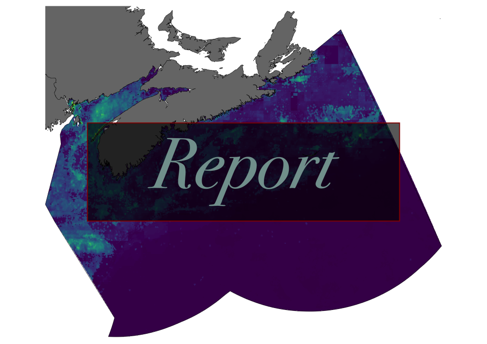

```{r setup, include=FALSE}
source("_setup.R")
# knitr::clean_cache(TRUE)
htmltools::tagList(
  xaringanExtra::use_clipboard(
    button_text = "<i class=\"fa fa-clipboard\"></i>",
    success_text = "<i class=\"fa fa-check\" style=\"color: #37abc8\"></i>",
  ),
  rmarkdown::html_dependency_font_awesome()
)
# xaringanExtra::use_scribble()

cols <- c("#777777", "#d66666", "#f0f518", "#2eb8dd", "#6a8868")
```


class: title-slide, middle


# Extraction de données et filtre de l'évaluation des effets cumulatifs des activités maritimes sur le Saint-Laurent et la rivière Saguenay pour le Servica Canadien de la Faune

<span class="br2"></span>

<center>
<a href ="report/index.html"></a>
<a href ="webinar/index.html"></a>
</img></center>

<span class="br2"></span>

<center><i>David Beauchesne, Kevin Cazelles, Steve Vissault</i></center>

<span class="br2"></span>

<center>
<a href="https://www.insileco.io/"></img></a>
</center>

