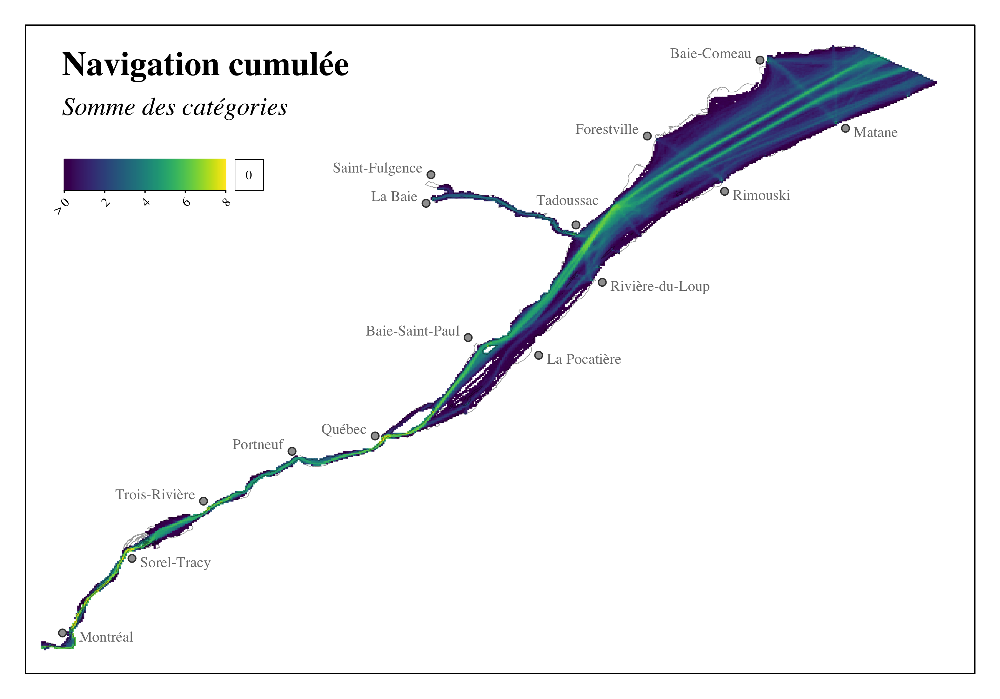
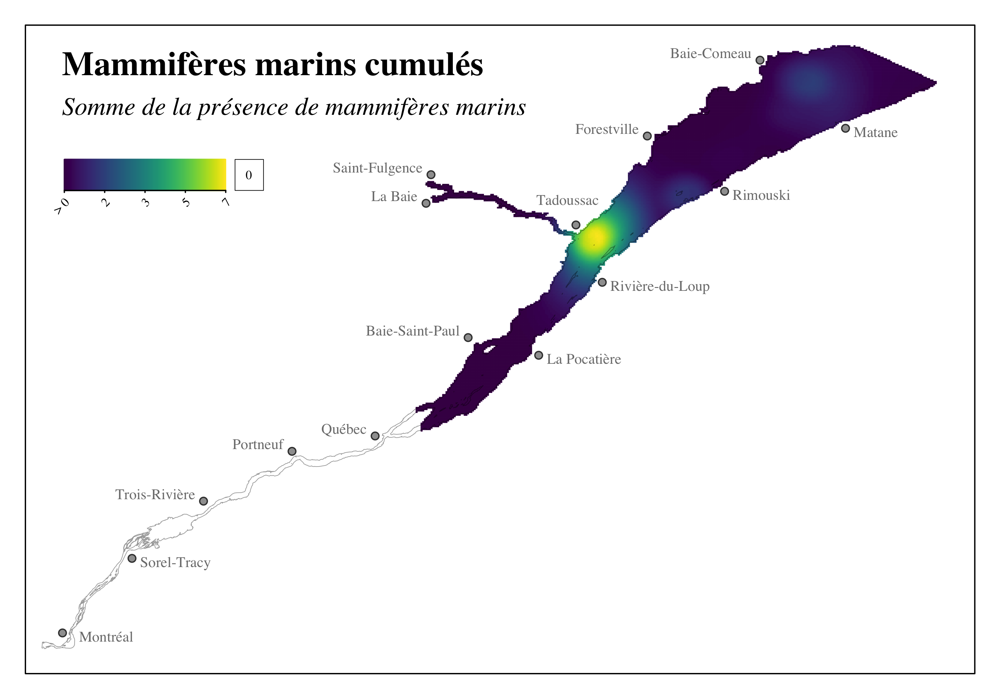

```{r setup, include=FALSE}
source("_setup.R")
# knitr::clean_cache(TRUE)
htmltools::tagList(
  xaringanExtra::use_clipboard(
    button_text = "<i class=\"fa fa-clipboard\"></i>",
    success_text = "<i class=\"fa fa-check\" style=\"color: #37abc8\"></i>",
  ),
  rmarkdown::html_dependency_font_awesome()
)
# xaringanExtra::use_scribble()

cols <- c("#777777", "#d66666", "#f0f518", "#2eb8dd", "#6a8868")
```


class: title-slide, middle


# Extraction de données et filtre de l’évaluation des effets cumulatifs des activités maritimes sur le Saint-Laurent et la rivière Saguenay pour le Servica Canadien de la Faune

<center></img></center>

<center><i>David Beauchesne, Kevin Cazelles, Steve Vissault</i></center>

<span class="br2"></span>

<center>
<a href="https://www.insileco.io/"></img></a>
</center>

<span class="br2"></span>

#### 2024-03-13

---

class: inverse, center, middle

# Évaluation des effets cumulatifs

<html><div style='float:left'></div><hr color='#ffdd55' style="margin-top:-30px" size=1px width=720px></html>

#### Contexte
### Portée de l'évaluation
### Méthode d'analyse 
### Portrait 
### Résultats
### Limites & perspectives


---
# Contexte 

.pull-left4[
## Initiative nationale 

- .font90[Cadre national d'évaluation des effets cumulatifs]
- .font90[Évaluations régionales (6)]

## Fleuve Saint-Laurent (QC)

- .font90[Gouvernement du Canada]
- .font90[Gouvernement du Québec]
- .font90[Premières Nations]
  - .font90[Nation Huronne-Wendat]
  - .font90[Nation des Innus d'Essipit]
  - .font90[Nation Mohawk de Kahnawà:ke]
  - .font90[Nation Wolastoqiyik Wahsipekuk]
  - .font90[Nation W8banaki]
- .font90[Intervenants locaux]
- .font90[Organisations non-gouvernementales]
]

.pull-right4[
<center></img></center>

<a href='https://www.donneesquebec.ca/'></a>
<a href='https://ogsl.ca/fr/accueil/'></a> 
<a href='https://open.canada.ca/fr'></a>

<center>
<a href="https://www.ulaval.ca/"></img></a>
&nbsp;&nbsp;&nbsp;&nbsp;&nbsp;&nbsp;&nbsp;&nbsp;&nbsp;&nbsp;
</img>
<!-- &nbsp;&nbsp;&nbsp;&nbsp;&nbsp;
</img> -->
</center>
]

---
# Contexte

## Service Canadien de la Faune (SCF)

*Filtrer l’évaluation originale en ne considérant que les composantes valorisées identifiées d’intérêt pour le SCF*

<br>

--
## Livrables

1. Identification des composantes valorisées d’intérêt pour le Service Canadien de la Faune

--
2. Extraction des données et résultats de l’évaluation des effets cumulatifs de la navigation sur les composantes valorisées sélectionnées par le SCF, comprennant:
  - [Un rapport sommaire d'évaluation](https://insileco.io/ceascf/)
  - Geodatabase comprenant les intrants et extrants du modèle d'évaluation des effets cumulatifs

--
3. Réunion et discussion abec l'équipe du SCF (aujourd'hui!)

---
class: inverse, center, middle

# Évaluation des effets cumulatifs

<html><div style='float:left'></div><hr color='#ffdd55' style="margin-top:-30px" size=1px width=720px></html>

### Contexte
#### Portée de l'évaluation
### Méthode d'analyse
### Portrait 
### Résultats
### Limites & perspectives

---
# Portée de l'évaluation

## Portée spatiale et temporelle <!-- &nbsp;&nbsp; <a href="maps/sa.html" target="_blank">`r mp()`</a> -->

.pull-left2[
#### Étendue spatiale

- Ouest: Châteaugay
- Est : Pointe-des-Monts et Cap-Chat
- Saguenay : Saint-Fulgence

#### Grille d'étude

- Cellules $1km^2$

#### Limites temporelles 

- Évaluation contemporaine 
- ~2000-2020 selon la disponibilité des données
]

.pull-right2[
<br>
<center>
<a href="https://effetscumulatifsnavigation.github.io/Rapport/figures/aoi.png">
</img>
</a>
</center>
]


---
# Portée de l'évaluation

## Stresseurs environnementaux & composantes valorisées

<br/>

<center></img></center>

---
class: inverse, center, middle

# Évaluation des effets cumulatifs

<html><div style='float:left'></div><hr color='#ffdd55' style="margin-top:-30px" size=1px width=720px></html>

### Contexte
### Portée de l'évaluation
#### Méthode d'analyse
### Portrait 
### Résultats
### Limites & perspectives

---
# Méthode d'analyse

<center></img></center>

.references[
Halpern et al. 2008; Halpern et al. 2015
]

---
# Méthode d'analyse

<center></img></center>


.references[
Halpern et al. 2008; Halpern et al. 2015
]

---
# Méthode d'analyse

<br/><br/>

<center></img></center>

.references[
Halpern et al. 2008; Halpern et al. 2015
]

---
# Méthode d'analyse

<center></img></center>

.references[
Halpern et al. 2008; Halpern et al. 2015
]

---
# Méthode d'analyse

<center></img></center>

.references[
Halpern et al. 2008; Halpern et al. 2015
]

---
class: inverse, center, middle

# Évaluation des effets cumulatifs

<html><div style='float:left'></div><hr color='#ffdd55' style="margin-top:-30px" size=1px width=720px></html>

### Contexte
### Portée de l'évaluation
### Méthode d'analyse
#### Portrait 
### Résultats
### Limites & perspectives

---
# Portrait: Stresseurs environnementaux 
<!-- .font70[(25 sous-catégories)] -->

<center>
<div class="divPortrait">
  <div class="divPortraitBody">
  
    <!-- Row 1 : text -->
    <div class="divPortraitRow">
      <div class="divPortraitCell"></div>
      <div class="divPortraitTitle">
        <b>Ancrages</b> (1) &nbsp;<a href="https://effetscumulatifsnavigation.github.io/Rapport/portrait.html#ancrage" target="_blank">`r bk()`</a>
      </div>
      <div class="divPortraitCell"></div>
      <div class="divPortraitTitle">
        <b>Déversements <br>accidentels</b> (3) &nbsp;<a href="https://effetscumulatifsnavigation.github.io/Rapport/portrait.html#deversement" target="_blank">`r bk()`</a>
      </div>
      <div class="divPortraitCell"></div>
      <div class="divPortraitTitle">
        <b>Dragage</b> (3) &nbsp;<a href="https://effetscumulatifsnavigation.github.io/Rapport/portrait.html#dragage" target="_blank">`r bk()`</a>
      </div>
    </div>
    
    <!-- Row 2: figures -->
    <div class="divPortraitRow">
      <div class="divPortraitData">0070<br>0071</div>
      <div class="divPortraitCell">
        <a href="figures/cumulative_st_ancrage.png" target="_blank">
          </img>
        </a>
      </div>
      <div class="divPortraitData">0016</div>
      <div class="divPortraitCell">
        <a href="figures/cumulative_st_deversement.png" target="_blank">
          </img>
        </a>
      </div>
      <div class="divPortraitData">0018<br>0019<br>0046<br>0048<br>0049<br>0050<br>0052<br>0069</div>
      <div class="divPortraitCell">
        <a href="figures/cumulative_st_dragage.png" target="_blank">
          </img>
        </a>      
      </div>
    </div>
    
    <!-- Row 3 : text -->
    <div class="divPortraitRow">
      <div class="divPortraitCell"></div>
      <div class="divPortraitTitle">
        <b>Naufrages</b> (1) &nbsp;<a href="https://effetscumulatifsnavigation.github.io/Rapport/portrait.html#naufrage" target="_blank">`r bk()`</a>
      </div>  
      <div class="divPortraitCell"></div>
      <div class="divPortraitTitle">
        <b>Navigation</b> (11) &nbsp;<a href="https://effetscumulatifsnavigation.github.io/Rapport/portrait.html#navigation" target="_blank">`r bk()`</a>
      </div>
      <div class="divPortraitCell"></div>
      <div class="divPortraitTitle">
        <b>Pêche commerciale</b> (5) &nbsp;<a href="https://effetscumulatifsnavigation.github.io/Rapport/portrait.html#pechecommerciale" target="_blank">`r bk()`</a>
      </div>
    </div>
    
    <!-- Row 4: figures -->
    <div class="divPortraitRow">
      <div class="divPortraitData">0062</div>
      <div class="divPortraitCell">
        <a href="figures/cumulative_st_naufrage.png" target="_blank">
          </img>
        </a>      
      </div>  
      <div class="divPortraitData">0020<br>0021<br>0028<br>0041<br>0047</div>
      <div class="divPortraitCell">
        <a href="figures/cumulative_st_navigation.png" target="_blank">
          </img>
        </a>      
      </div>
      <div class="divPortraitData">0033<br>0034<br>0035</div>
      <div class="divPortraitCell">
        <a href="figures/cumulative_st_peche_commerciale.png" target="_blank">
          </img>
        </a>      
      </div>  
    </div>

    <!-- Row 5 : text -->
    <div class="divPortraitRow">
      <div class="divPortraitCell"></div>
      <div class="divPortraitCell"></div>
      <div class="divPortraitCell"></div>
      <div class="divPortraitTitle">
        <b>Pollution maritime</b> (1) &nbsp;<a href="https://effetscumulatifsnavigation.github.io/Rapport/portrait.html#pollutionmaritime" target="_blank">`r bk()`</a>
        </div>
    </div>
    
    <!-- Row 6: figures -->
    <div class="divPortraitRow">
      <div class="divPortraitCell"></div>
      <div class="divPortraitInfo">
        `r nf()` Les identifiants numériques <br>sont associés aux bases de <br> données utilisées (<a href="https://effetscumulatifsnavigation.github.io/Rapport/annexe1.html">annexe 1</a>)
      </div>
      <div class="divPortraitData">0018,0019<br>0020,0021<br>0028,0033<br>0034,0035<br>0041,0046<br>0047,0048<br>0049,0050</div>
      <div class="divPortraitCell">
        <a href="figures/cumulative_st_pollution_maritime.png" target="_blank">
          </img>
        </a>      
      </div>
      <div class="divPortraitData">0052,0069<br>0070,0071</div>
      

  </div>
</div>
</center>


---
# Portrait: Composantes valorisées 
<!-- .font70[(77 sous-catégories)] -->

<center>
<div class="divPortrait">
  <div class="divPortraitBody">
  
    <!-- Row 1 : text -->
    <div class="divPortraitRow">
      <div class="divPortraitCell"></div>
      <div class="divPortraitTitle">
        <b>Habitats floristiques et fauniques</b> (26) &nbsp;<a href="https://effetscumulatifsnavigation.github.io/Rapport/portrait.html#habitat" target="_blank">`r bk()`</a>
      </div>
      <div class="divPortraitCell"></div>
      <div class="divPortraitTitle">
        <b>Intégrité des berges</b> (4) &nbsp;<a href="https://effetscumulatifsnavigation.github.io/Rapport/portrait.html#berge" target="_blank">`r bk()`</a>
      </div>
    </div>
    
    <!-- Row 2: figures -->
    <div class="divPortraitRow">
      <div class="divPortraitData">
         0001,0002<br>
         0003,0009<br>
         0010,0013<br>
         0014,0017<br>
         0043,0053<br>
         0057,0058<br>
         0059,0060<br>
      </div>
      <div class="divPortraitCell">
        <a href="figures/cumulative_cv_habitat.png" target="_blank">
          </img>
        </a>
      </div>
      <div class="divPortraitData">0017</div>
      <div class="divPortraitCell">
        <a href="figures/cumulative_cv_berge.png" target="_blank">
          </img>
        </a>
      </div>
    </div>
    
    <!-- Row 3 : text -->
    <div class="divPortraitRow">
      <div class="divPortraitCell"></div>
      <div class="divPortraitTitle">
        <b>Mammifères marins</b> (9) &nbsp;<a href="https://effetscumulatifsnavigation.github.io/Rapport/portrait.html#mammiferesmarins" target="_blank">`r bk()`</a>
      </div>
      <div class="divPortraitCell"></div>
      <div class="divPortraitTitle">
        <b>Sites d'intérêt cultirels, patrimoniaux <br>et archéologiques</b> (43) &nbsp;<a href="https://effetscumulatifsnavigation.github.io/Rapport/portrait.html#habitat" target="_blank">`r bk()`</a>
      </div>
    </div>
    
    <!-- Row 4: figures -->
    <div class="divPortraitRow">
      <div class="divPortraitData">0027<br>0054</div>
      <div class="divPortraitCell">
        <a href="figures/cumulative_cv_mammiferes_marins.png" target="_blank">
          </img>
        </a>      
      </div>  
      <div class="divPortraitData">
        0022,0023<br>
        0024,0025<br>
        0030,0032<br>
        0038,0039<br>
        0044,0045<br>
        0055,0066<br>
        0067,0068<br>
        0072<br>
      </div>
      <div class="divPortraitCell">
        <a href="figures/cumulative_cv_site.png" target="_blank">
          </img>
        </a>      
      </div>
    </div>

  </div>
</div>
</center>

.references[
`r nf()` Les identifiants numériques sont associés aux bases de données utilisées (<a href="https://effetscumulatifsnavigation.github.io/Rapport/annexe1.html">annexe 1</a>)
]

---
# Portrait: Composantes valorisées (filtrées)
<!-- .font70[(77 sous-catégories)] -->

<center>
<div class="divPortrait">
  <div class="divPortraitBody">
  
    <!-- Row 1 : text -->
    <div class="divPortraitRow">
      <div class="divPortraitCell"></div>
      <div class="divPortraitTitle">
        <b>Habitats floristiques et fauniques</b> (21) &nbsp;<a href="https://effetscumulatifsnavigation.github.io/Rapport/portrait.html#habitat" target="_blank">`r bk()`</a>
      </div>
      <div class="divPortraitCell"></div>
      <div class="divPortraitTitle">
        <b>Intégrité des berges</b> (4) &nbsp;<a href="https://effetscumulatifsnavigation.github.io/Rapport/portrait.html#berge" target="_blank">`r bk()`</a>
      </div>
    </div>
    
    <!-- Row 2: figures -->
    <div class="divPortraitRow">
      <div class="divPortraitData">
         0017,0053<br>
         0059,0060<br>
         0077,0084<br>
      </div>
      <div class="divPortraitCell">
        <a href="figures/cumulative_cv_habitat.png" target="_blank">
          </img>
        </a>
      </div>
      <div class="divPortraitData">0017</div>
      <div class="divPortraitCell">
        <a href="figures/cumulative_cv_berge.png" target="_blank">
          </img>
        </a>
      </div>
    </div>
    
    <!-- Row 3 : text -->
    <div class="divPortraitRow">
      <div class="divPortraitCell"></div>
      <div class="divPortraitTitle">
        <b>Mammifères marins</b> (0)
      </div>
      <div class="divPortraitCell"></div>
      <div class="divPortraitTitle">
        <b>Sites d'intérêt cultirels, patrimoniaux <br>et archéologiques</b> (1) &nbsp;<a href="https://effetscumulatifsnavigation.github.io/Rapport/portrait.html#habitat" target="_blank">`r bk()`</a>
      </div>
    </div>
    
    <!-- Row 4: figures -->
    <div class="divPortraitRow">
      <div class="divPortraitData"></div>
      <div class="divPortraitCell">
      </div>  
      <div class="divPortraitData">
        0030,0038<br>
        0039,0082<br>
      </div>
      <div class="divPortraitCell">
        <a href="figures/cumulative_cv_site.png" target="_blank">
          </img>
        </a>      
      </div>
    </div>

  </div>
</div>
</center>

.references[
`r nf()` Les identifiants numériques sont associés aux bases de données utilisées (<a href="https://effetscumulatifsnavigation.github.io/Rapport/annexe1.html">annexe 1</a>)
]


---
class: inverse, center, middle

# Évaluation des effets cumulatifs

<html><div style='float:left'></div><hr color='#ffdd55' style="margin-top:-30px" size=1px width=720px></html>

### Contexte
### Portée de l'évaluation
### Méthode d'analyse
### Portrait 
#### Résultats
### Limites & perspectives

---

# Résultats

## Stresseurs cumulés

<br2>

.pull-left2[
- Distribution dans l'ensemble de la zone d'étude

- Villes portuaires et voie navigable

- Navigation et pollution maritime plus répandus

]
.pull-right2[
<br>
[<center></img></center>](https://effetscumulatifsnavigation.github.io/Rapport/figures/figures-output/cumulative_st.png)
]

---
# Résultats

## Composantes valorisées cumulées

.pull-left2[
- Distribution dans l'ensemble de la zone d'étude

- Milieux côtiers diversifiés en composantes valorisées

- Région du lac Saint-Pierre

- Embouchure de la Rivière Saguenay, rivère Saguenay & Côte-Nord
]
.pull-right2[
<br>
[<center></img></center>](https://insileco.io/ceascf/figures/ceascf/figures-output/cumulative_cv.png)
]

---
# Résultats

## Effets cumulatifs

.pull-left2[
- Généralisés et intensités variables
- Secteur fluvial: intense et concentré 
  - .font90[Québec et sud de l'Île d'Orléans]
  - .font90[Lac Saint-Pierre]
  - .font90[Chenal de navigation (Montréal - Trois-Rivières)]
- Secteur maritime: diffus
  - .font90[Embouchure de la rivière Saguenay, rivière Saguenay, Côte-Nord]
]
.pull-right2[
<br>
[<center></img></center>](https://insileco.io/ceascf/figures/ceascf/figures-output/cumulative_effects.png)
]

---
# Résultats

## Chemins d'effets

.pull-left2[
- Vue d'ensemble de l'évaluation
- 494 chemins d'effets directs 
- Score moyen: 0.08 ± 0.09 (maximum théorique = 1)
]

.pull-right2[
[<center></img></center>](https://insileco.io/ceascf/figures/ceascf/figures-output/cumulative_effects_metanetwork.png)
]


---
# Résultats

## Contribution régionale: .font90[Stresseurs environnementaux]

.pull-left2[
- .font90[Navigation et pollution maritime]
- .font90[Effets ciblés des pêches commerciales]
]
.pull-right2[ 
- .font90[Effets localisés des ancrages, déversements accidentels et activités de dragage]
- .font90[Chevauchement au sein de milieux les plus affectés comme le lac Saint-Pierre]
]

[<center></img></center>](https://insileco.io/ceascf/figures/ceascf/figures-output/cumulative_effects_regional_contribution.png)

---
class: inverse, center, middle

# Évaluation des effets cumulatifs

<html><div style='float:left'></div><hr color='#ffdd55' style="margin-top:-30px" size=1px width=720px></html>

### Contexte
### Portée de l'évaluation
### Méthode d'analyse
### Portrait 
### Résultats
#### Limites & perspectives


---
class: inverse, center, middle

# Merci! 

<html><div style='float:left'></div><hr color='#ffdd55' style="margin-top:-30px" size=1px width=720px></html>


<!--
rmarkdown::render('./index.Rmd')
xaringan::decktape("https://effetscumulatifsnavigation.github.io/WebinaireMethode", "Webinaire.pdf", docker = FALSE)
-->
